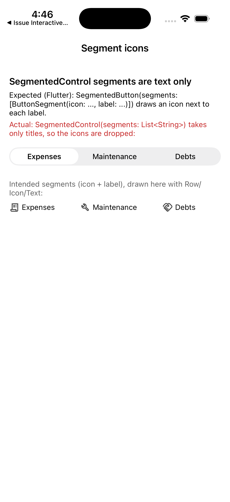

# Repro: SegmentedControl segments can't have icons

Issue: https://github.com/DartNative/dartnative/issues/69

`SegmentedControl` takes `segments: List<String>`, so a segment can only be a title. Flutter's `SegmentedButton` takes `ButtonSegment(icon:, label:)`, and apps ported from it lose their segment icons (here: a receipt, a wrench and a handshake for Expenses / Maintenance / Debts).

## Run

`dn run` (iOS simulator; Android behaves the same unless stated).

## What you'll see

A text-only `SegmentedControl` with "Expenses", "Maintenance", "Debts". Below it, the intended icon + label pairs drawn by hand with `Row`/`Icon`/`Text` so you can see what is missing.

## Expected

Each segment shows its icon next to (or instead of) its label, as `SegmentedButton` does in Flutter, and as `UISegmentedControl` (`setImage(_:forSegmentAt:)`, `UIAction(title:image:)`) and Material's segmented button support natively.

## What we'd write in Flutter

```dart
SegmentedButton<int>(
  segments: const [
    ButtonSegment(value: 0, icon: Icon(Icons.receipt_long), label: Text('Expenses')),
    ButtonSegment(value: 1, icon: Icon(Icons.build), label: Text('Maintenance')),
    ButtonSegment(value: 2, icon: Icon(Icons.handshake), label: Text('Debts')),
  ],
  selected: {view},
  onSelectionChanged: (s) => setState(() => view = s.first),
)
```

`dn analyze` on 1.0.0:

```
error • The function 'SegmentedButton' isn't defined • undefined_function
error • The function 'ButtonSegment' isn't defined • undefined_function
```

## Recording



## Environment

- DartNative 1.0.0 (SDK `113c27aacb2`, framework edition `7ae29132`), Dart 3.12.0
- macOS 26.7.1, Xcode 26.1.1
- iPhone 17 simulator, iOS 26.1
